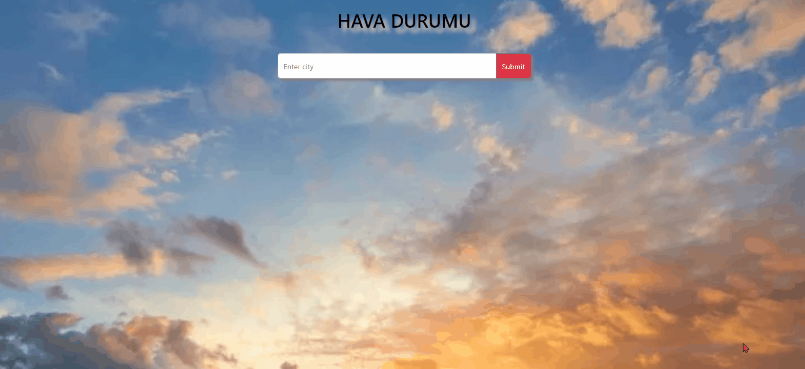

# Weather App

### Check The Live Website ➡️ [Live Website](https://weather-project-mirayengin.vercel.app//)

### Description

Project aims to create a Weather App.

### Visualization of the Website



### Project Skeleton

```
Random-User-App (folder)
|
|----readme.md
SOLUTION
├── index.html
├── style.css
├── weather.js
├── WeatherApp.gif

```

### Used in this project

👉 I mastered DOM Manıpulation,Fetch, HTML, CSS and Javascript features in this project. You can see the visual representation of the website above.
